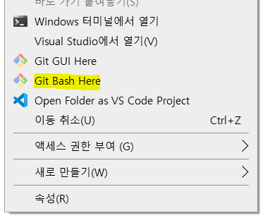
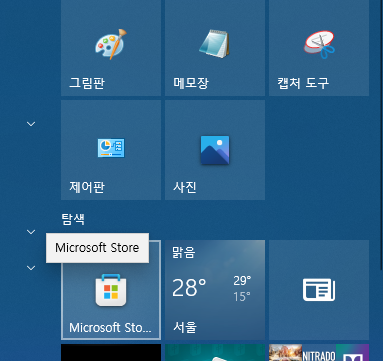
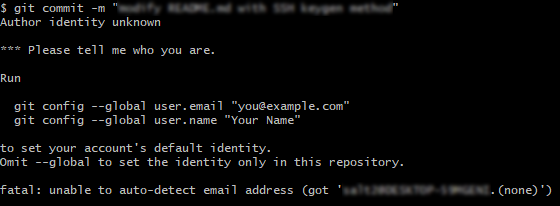

# Git 명령어 안내
## 목차
- [Git 명령어 안내](#git-명령어-안내)
  - [목차](#목차)
  - [기본 개념](#기본-개념)
  - [설치](#설치)
    - [Windows](#windows)
    - [Linux (Ubuntu/Debian)](#linux-ubuntudebian)
    - [Mac](#mac)
  - [사용법](#사용법)
    - [Windows](#windows-1)
      - [Git Bash 이용](#git-bash-이용)
      - [Windows Terminal (PowerShell) 이용](#windows-terminal-powershell-이용)
    - [Linux/Mac](#linuxmac)
  - [명령어 상세](#명령어-상세)
    - [0. 초기 설정](#0-초기-설정)
      - [SSH 키 생성 및 GitHub에의 등록](#ssh-키-생성-및-github에의-등록)
      - [계정 아이덴티티 설정](#계정-아이덴티티-설정)
    - [1. 프로젝트를 새로 생성할 때](#1-프로젝트를-새로-생성할-때)
    - [2. 로컬 작업 환경의 변경사항을 로컬 레포지토리에 반영할 때](#2-로컬-작업-환경의-변경사항을-로컬-레포지토리에-반영할-때)
    - [3. 로컬 레포지토리의 변경사항을 원격 레포지토리에 업로드할 때](#3-로컬-레포지토리의-변경사항을-원격-레포지토리에-업로드할-때)
    - [4. 원격 레포지토리의 변경사항을 로컬 레포지토리 및 작업 환경에 다운로드할 때](#4-원격-레포지토리의-변경사항을-로컬-레포지토리-및-작업-환경에-다운로드할-때)
    - [5. 머지 컨플릭트 해결법](#5-머지-컨플릭트-해결법)
    - [6. 브랜치를 변경할 때](#6-브랜치를-변경할-때)
    - [7. 풀 리퀘스트 날리는 법](#7-풀-리퀘스트-날리는-법)
    - [8. 잘못된 변경사항을 되돌리는 법](#8-잘못된-변경사항을-되돌리는-법)
    - [9. 알아두면 유용한 명령들](#9-알아두면-유용한-명령들)
  - [명령어 요약](#명령어-요약)

---

## 기본 개념
* Git: 버전 관리 시스템의 일종.
* 로컬 작업 환경: 내 컴퓨터의 폴더에 있는 파일들을 말한다. 파일을 열어서 직접 수정할 수 있다.
* 로컬 레포지토리: 내 컴퓨터의 `.git` 폴더 안에서 Git이 관리하는 파일들을 말한다. 직접 수정할 수는 없지만 Git 명령어를 통해 조작할 수 있다.
* 원격 레포지토리: GitHub 등 원격 서버에 저장되어 관리되는 파일들을 말한다. 다른 사용자들과 공유된다.

## 설치
> https://git-scm.com/book/ko/v2/%EC%8B%9C%EC%9E%91%ED%95%98%EA%B8%B0-Git-%EC%84%A4%EC%B9%98

### Windows
* **[자세한 설치법](./Install-Windows.md)**
  * *문서가 너무 길어져서 따로 뺐습니다.*
* 패키지 매니저를 통한 설치법
  * `winget install -e --id Git.Git`

### Linux (Ubuntu/Debian)
* `sudo apt install git`

### Mac
* `brew install git`

## 사용법
### Windows
#### Git Bash 이용
* 
* 프로젝트의 루트 폴더에서(또는 새 폴더를 생성하고 그 안에 들어가서) 파일 탐색기의 빈 공간을 마우스 우클릭 - Git Bash Here 실행
* 후술할 Git 명령어를 상황에 맞게 입력

#### Windows Terminal (PowerShell) 이용
* Microsoft Store 앱 실행
  * 아래 사진처럼 시작 메뉴에서 실행 가능
  * 
* 아래 사진처럼 "Windows Terminal" 검색 후 다운로드
  * 
* "Windows Terminal" 실행
  * "Windows PowerShell"이 기본값으로 열린다.
  * 다른 것이 열린다면 아래 사진처럼 아래 화살표 버튼을 누르고 "Windows PowerShell"을 실행한다.
  * 
* `cd "경로"` 명령을 통해 프로젝트의 루트 폴더로 이동
* 후술할 Git 명령어를 상황에 맞게 입력

### Linux/Mac
* 셸 또는 터미널에서 `cd` 명령을 통해 프로젝트의 루트 폴더로 이동
* 후술할 Git 명령어를 상황에 맞게 입력

## 명령어 상세
### 0. 초기 설정
#### SSH 키 생성 및 GitHub에의 등록
* **[자세한 안내](./SSH.md)**
  * *문서가 너무 길어져서 따로 뺐습니다.*

#### 계정 아이덴티티 설정
1. Git Bash (Windows) 또는 터미널(Linux/Mac) 실행
2. `git config --global user.email "you@example.com"`
   * `you@example.com` 부분은 자신의 이메일로 대체해서 적는다.
   * `--global` 옵션은 이 컴퓨터의 모든 레포지토리(앞으로 생성될 레포지토리 포함)에 같은 아이덴티티를 적용하겠다는 의미이다.
     * 이 레포지토리에만 이 아이덴티티를 적용하고 싶다면 `--global` 옵션을 생략하고 실행한다.
3. `git config --global user.name "Your Name"`
   * `Your Name` 부분은 자신의 이름을 영어로 대체해서 적는다.
   * `--global` 옵션은 이 컴퓨터의 모든 레포지토리(앞으로 생성될 레포지토리 포함)에 같은 아이덴티티를 적용하겠다는 의미이다.
     * 이 레포지토리에만 이 아이덴티티를 적용하고 싶다면 `--global` 옵션을 생략하고 실행한다.

### 1. 프로젝트를 새로 생성할 때
1. GitHub에서 새로운 원격 레포지토리 생성
   * GitHub 홈페이지에 Sign in 후 New 버튼을 누르고 레포지토리 이름을 정해서 생성하면 된다.
2. 아래 사진처럼 초록색 "Code" 버튼을 누르고 표시되는 주소 복사
   * 
   * HTTPS보다는 SSH 주소를 사용하는 것을 추천한다.
   * 다만 SSH 주소를 사용하려면 사전 작업이 필요하다.
   * SSH 키를 생성하고 공개키를 GitHub에 등록하는 과정은 [SSH 키 생성 및 GitHub에의 등록](#ssh-키-생성-및-github에의-등록)을 참조한다.
3. `git init`
   * 해당 폴더를 로컬 작업 환경으로 하고 로컬 레포지토리를 생성하는 명령이다.
4. `git remote add origin [원격 레포지토리의 SSH 또는 HTTPS 주소 붙여넣기]`
   * origin 말고 다른 이름을 사용할 수 있지만 보통은 origin 사용
   * Windows 기준으로 Git Bash에 주소를 붙여넣을 때에는 오른쪽 클릭 후 Paste 선택
   * 예: `git remote add origin git@github.com:upnl/simple-dodge-reference.git`
5. `git fetch origin`
   * SSH 키 설정이 되어 있지 않다면 아래 사진과 같은 문구가 뜰 수 있다.
     * 
     * 여기에서 `yes`를 입력하면 되는데, 이때 `Permission denied` 오류가 뜰 수 있다. 이 경우 [SSH 키 생성 및 GitHub에의 등록](#ssh-키-생성-및-github에의-등록)을 수행한 후에 다시 시도하자.
   * SSH 키 생성 시 비밀번호를 설정한 경우, 비밀번호를 입력해야 fetch 명령이 실행된다.
6. 로컬 작업 환경에서 파일 생성 및 수정
7. [로컬 작업 환경의 변경사항을 로컬 레포지토리에 반영할 때](#2-로컬-작업-환경의-변경사항을-로컬-레포지토리에-반영할-때)의 명령어 입력

### 2. 로컬 작업 환경의 변경사항을 로컬 레포지토리에 반영할 때
> Git은 변경사항을 자동으로 추적하지 못한다. 따라서 어느 파일이 어떻게 바뀌었는지 Git에게 알려주는 작업이 필요하다.
1. 브랜치가 내가 작업할 브랜치인지 확인
   * 처음 프로젝트를 시작하면 기본 브랜치가 `main`으로 설정되어 있다.
   * 혼자 작업할 때에는 아무 브랜치에서 작업해도 상관 없지만, 공동으로 작업할 때에는 개인별로 하나씩의 브랜치를 파서 각자의 브랜치에서 작업한 후에 `main`으로의 풀 리퀘스트를 날리는 것이 권장된다.
   * 브랜치를 변경하거나 새로 파야 하는 경우 [브랜치를 변경할 때](#6-브랜치를-변경할-때)의 명령어를 입력한다.
2. 로컬 작업 환경에서 파일 변경
3. `git status`
   * 어떤 파일이 변경되었는지 확인한다.
4. `git add .`
   * 로컬 작업 환경에서 변경된 모든 파일을 Git이 추적하게 해준다.
   * 모든 파일이 아닌 특정 파일만 Git이 추적하게 하려면, `.` 대신 해당 파일의 경로를 입력하면 된다.
     * 예: `git add ./Repository/Assets/Scripts/Player/Player.cs`
5. `git commit -m "[커밋 메시지]"`
   * Git이 추적하고 있는 변경사항을 현재 브랜치에 커밋하여 반영한다.
   * 커밋 메시지는 남들이 메시지만 봐도 무엇이 바뀌었는지 쉽게 알 수 있도록 친절하게, 요약하여 작성한다.
     * 좋은 예: `git commit -m "Add some sprites and fix scroll bug"`
     * 나쁜 예: `git commit -m "minor"`
   * 커밋 메시지를 한글로 작성하는 것도 가능하다.
   * 한번 커밋하면 되돌리기 어렵다. 신중히 입력하자.
     * 지난 커밋을 조작하는 방법이 있기는 하지만, 여기서 다루지는 않겠다.
     * 잘못된 커밋을 `git push`하면 정말 큰일난다. 이때는 조작하기도 어렵다.
   * 계정 아이덴티티 설정이 되어 있지 않다면 커밋 시 아래 사진과 같은 문구가 뜨면서 커밋이 되지 않을 수 있다.
     * 
     * 이 경우 [계정 아이덴티티 설정](#계정-아이덴티티-설정)을 수행한 후에 다시 시도하자.
6. [로컬 레포지토리의 변경사항을 원격 레포지토리에 업로드할 때](#3-로컬-레포지토리의-변경사항을-원격-레포지토리에-업로드할-때)의 명령어 입력

### 3. 로컬 레포지토리의 변경사항을 원격 레포지토리에 업로드할 때
> 변경사항을 서버에 올려서 다른 사람도 볼 수 있게 하는 작업이다.
1. `git push -u origin [브랜치 이름]`
   * 아무 경고가 뜨지 않으면 완료된 것이다! 이때는 GitHub에 들어가 변경사항이 잘 업로드되었는지 확인한다.
   * 다음과 같은 경고가 뜨면서 실패하는 경우가 있다.
     * 메시지 예:
       * `error: failed to push some refs to '[레포지토리 주소]'`
       * `hint: Updates were rejected because the remote contains work that you do`
       * `hint: not have locally. This is usually caused by another repository pushing`
       * `hint: to the same ref. You may want to first integrate the remote changes`
       * `hint: (e.g., 'git pull ...') before pushing again.`
       * `hint: See the 'Note about fast-forwards' in 'git push --help' for details.`
     * 이 경우에는 [원격 레포지토리의 변경사항을 로컬 레포지토리 및 작업 환경에 다운로드할 때](#4-원격-레포지토리의-변경사항을-로컬-레포지토리-및-작업-환경에-다운로드할-때)의 명령어를 입력한다.
   * `-u` 옵션의 의미는 [여기](https://wotres.tistory.com/entry/git-push-u-%EC%98%B5%EC%85%98-%EC%82%AC%EC%9A%A9-%EC%9D%B4%EC%9C%A0) 참조
   * 잘못된 커밋이 있는 경우 절대 `git push`하지 말고 로컬에서 커밋을 조작하는 것을 추천한다.
     * 지난 커밋을 조작하는 방법은 여기서 다루지 않는다. 검색해서 찾아보기를 바란다.

### 4. 원격 레포지토리의 변경사항을 로컬 레포지토리 및 작업 환경에 다운로드할 때
1. `git fetch origin`
   * 원격 레포지토리의 변경사항이 로컬 레포지토리에 반영된다.
2. `git pull origin [현재 브랜치 이름]`
   * 원격 레포지토리의 변경사항이 로컬 작업 환경에 반영된다.
   * 가끔 merge conflict가 뜨면서 이 명령이 실패하는 경우가 발생한다.
      * 메시지 예:
       * `CONFLICT (content): Merge conflict in [파일 이름]`
       * `Automatic merge failed; fix conflicts and then commit the result.`
     * 이것은 두 명 이상의 사람이 같은 시기에 특정 파일의 특정 부분을 서로 다르게 변경하여 발생하는 충돌이다.
     * 이때는 [머지 컨플릭트 해결법](#5-머지-컨플릭트-해결법)을 수행한다.
     * 특히 Unity를 사용할 때 같은 scene을 둘 이상의 사람들이 동시에 변경해서 머지 컨플릭트가 발생하게 되면 다른 파일들보다 해결하기 어렵기 때문에 가급적 scene 파일은 한 번에 한 사람만 수정하는 것으로 한다.
   * 현재 브랜치 이름 대신 다른 브랜치 이름을 입력해서 `git pull origin [다른 브랜치 이름]`을 수행하는 경우, `다른 브랜치`가 `현재 브랜치`에 merge된다.
     * `git merge`에 익숙하지 않다면 이것을 하는 것을 추천하지 않는다.
3. push를 하려던 중이었다면 다시 [로컬 작업 환경의 변경사항을 로컬 레포지토리에 반영할 때](#2-로컬-작업-환경의-변경사항을-로컬-레포지토리에-반영할-때)부터 하나씩 실행한다.

### 5. 머지 컨플릭트 해결법
> 두 명 이상의 사람들이 같은 파일의 같은 부분을 동시에 서로 다르게 수정하는 경우에 머지 컨플릭트가 발생한다.

> 머지 컨플릭트가 일어나면 Git에게 두 변경사항 중 어느 것을 반영하고 어느 것을 버려야 하는지 알려주어야 한다.

* 우선 `git status`를 입력해보자.
  * 충돌한 파일이 어떤 것들이 있는지 알려준다.
* 충돌이 일어난 파일의 종류에 따라 해결 방법이 다르다.
  * 텍스트 기반 파일 (코드 등)
    1. 텍스트 편집기로 해당 파일을 연다.
    2. 검색(Ctrl+F)을 활용하여 `<<<<<<<` (`<` 7개)를 검색한다. 검색된 모든 부분에 대해 아래 3.과 4.의 과정을 반복한다.
    3. `<<<<<<<`가 있는 줄 아래부터 `========`이 있는 줄까지는 내 현재 브랜치에서 변경한 사항이 들어있고, `=======` 아래부터 `>>>>>>>`가 있는 줄까지는 머지하려는 브랜치(보통 다른 사람이 만든, 원격 레포지토리의 브랜치)에서 변경한 사항이 들어있다.
    4. 직접 보면서 적절하게 변경사항을 하나로 합치고, `<<<<<<<`가 있는 줄과 `=======`가 있는 줄과 `>>>>>>>`가 있는 줄을 모두 지운 다음, 파일을 저장한다.
      * 내가 만든 변경사항을 살릴지, 다른 사람이 만든 변경사항을 살릴지, 둘을 적절히 병합할지는 그때그때 다르다.
    5. 모든 머지 컨플릭트가 해결되면 [로컬 작업 환경의 변경사항을 로컬 레포지토리에 반영할 때](#2-로컬-작업-환경의-변경사항을-로컬-레포지토리에-반영할-때)의 명령어를 입력한다.
    6. 커밋 후 `git push` 명령어를 입력하면 커밋 메시지 에디터(Git 설치 시에 설정했던, VS Code, 메모장, Vim 등의 에디터)가 열리면서 `Merge branch '[머지하려는 브랜치]' into [내 현재 브랜치]`가 뜰 때가 있다.
      * 이것이 머지 커밋이다.
      * 이때는 에디터를 닫아주면 정상적으로 머지 커밋과 `git push`가 진행된다.
      * 머지 커밋 메시지를 변경하고 싶으면 변경해도 되는데, 이때는 변경 후 저장하고 에디터를 종료하면 된다.
  * 바이너리 파일 (응용 프로그램, 이미지 등)
    * 편집기로 직접 수정하기 어려운 파일이므로, 두 변경사항 중 하나를 취사선택하는 것만 가능하다.
    1. 내 현재 브랜치의 변경사항을 살릴 때 (머지하려는 브랜치의 변경사항을 버릴 때)
      * `git checkout --ours -- [충돌한 파일 경로]`
      * (띄어쓰기에 유의)
    2. 머지하려는 브랜치의 변경사항을 살릴 때 (내 현재 브랜치의 변경사항을 버릴 때)
      * `git checkout --theirs -- [충돌한 파일 경로]`
      * (띄어쓰기에 유의)
    * 모든 충돌을 해결했으면 `git push` 명령어를 입력한다. 이때 커밋 메시지 에디터가 뜰 수 있는데, 에디터를 닫아주면 정상적으로 머지 커밋과 `git push`가 진행된다.
  * Unity의 `.unity`(scene) 파일 및 `.prefab`(프리팹) 파일
    * 가급적이면 `.unity` 파일 및 `.prefab` 파일에서 머지 컨플릭트가 발생하지 않도록 일감과 일정을 분배하는 것이 중요하다.
      * 한 번에 한 사람만 건드리도록 하고, 동시에 여러 명이 같은 파일을 가지고 작업하지 않아야 한다.
    * 그래도 머지 컨플릭트가 발생했다면 아래의 세 가지 방법으로 해결할 수 있다.
      1. 내가 해당 scene에 새로 만든 변경사항들을 패치노트처럼 전부 기억한 다음, 원격 레포지토리의 최신 버전(내 것과 충돌한 버전)을 만들어낸 상대방의 컴퓨터에서 Unity 에디터로 해당 scene을 열어서, 내가 만들었던 변경사항들을 똑같이 수동으로 반영하고 그것으로 덮어쓰는 방법
         * **가장 추천하는 방법!**
      2. 바이너리 파일처럼 두 변경사항 중 하나를 취사선택하는 방법
         * 이 경우 한 쪽의 변경사항은 전부 버려지게 된다.
      3. 텍스트 기반 파일처럼  **텍스트 편집기로** 해당 파일을 열고 머지 컨플릭트를 수동으로 해결하는 방법 **(절대 비추천)**
         * Unity 에디터로 열지 않음에 유의!
         * `.unity` 파일이 기본적으로 yaml 구조라서 가능하긴 하지만...
         * 사용자는 Unity가 내부적으로 관리하는 에셋 ID를 알 방법이 없고, 이것이 꼬이면 굉장히 큰일이 난다.
         * 잘못 병합하면 scene 파일 구조가 깨져서 Unity로 열리지 않게 될 수 있다!
    * 모든 충돌을 해결했으면 `git push` 명령어를 입력한다. 이때 커밋 메시지 에디터가 뜰 수 있는데, 에디터를 닫아주면 정상적으로 머지 커밋과 `git push`가 진행된다.

### 6. 브랜치를 변경할 때
> 공동으로 작업할 때에는 개인별로 하나씩의 브랜치를 파서 각자의 브랜치에서 작업한 후에 `main`으로의 풀 리퀘스트를 날리는 것이 권장된다.

1. `git status`
   * 현재 브랜치 이름을 확인한다.
2. `git checkout [다른 브랜치 이름]`
   * 이미 만들어져 있는 다른 브랜치로 이동한다.
   * 브랜치를 변경하면 로컬 작업 환경의 파일들이 새 브랜치에 맞게 통째로 바뀐다.
   * 따라서 브랜치 변경 전에, 반드시 모든 파일을 저장하고 [로컬 작업 환경의 변경사항을 로컬 레포지토리에 반영할 때](#2-로컬-작업-환경의-변경사항을-로컬-레포지토리에-반영할-때)의 명령어를 모두 수행하여야 한다.
   * 이 명령을 수행하면 브랜치가 변경되지만, 해당 브랜치가 존재하지 않고 새로 만들어야 하는 경우에는 3. 이하를 수행한다.
   * *Git 2.25부터 `git checkout` 명령어가 `git switch` 및 `git restore`의 두 명령어로 분리되었다. 그러나 아직은 `git checkout`을 사용해도 된다.*
3. `git branch`
   * 로컬 레포지토리에 있는 브랜치 목록을 보여준다.
4. `git checkout -b [새 브랜치 이름]`
   * 로컬 레포지토리에 새 브랜치를 파고 이 브랜치로 이동한다.
   * 이 명령은 다음 두 명령을 순서대로 입력한 것과 동일하다.
     * `git branch [새 브랜치 이름]`
     * `git checkout [새 브랜치 이름]`
   * 새 브랜치로 이동할 경우 로컬 작업 환경이 그대로 유지된다.
   * 새 브랜치를 만들더라도 `git push`를 하기 전까지는 로컬 레포지토리에만 이 브랜치가 존재한다.
     * `git push -u origin [새 브랜치 이름]`을 하게 되면 원격 레포지토리에도 이 브랜치가 생성된다.

### 7. 풀 리퀘스트 날리는 법
> 내 브랜치에서 작업한 커밋들을 `main` 브랜치에 합쳐서 다른 사람들에게도 보이도록 하고 싶을 때 풀 리퀘스트(PR)을 날린다.

> 공동으로 작업할 때, 내 브랜치를 직접 `main` 브랜치에 `git merge`해서 `git push`하는 것은 권장되지 않는다.

1. 내 브랜치에서 만든 모든 변경사항을 원격 레포지토리에 업로드
   * [로컬 레포지토리의 변경사항을 원격 레포지토리에 업로드할 때](#3-로컬-레포지토리의-변경사항을-원격-레포지토리에-업로드할-때)까지의 과정을 수행한 상태이면 된다.
2. GitHub에 접속하여 작업 중인 레포지토리로 이동
3. 아래 사진처럼 "Pull requests" 탭으로 이동
   * 
4. 초록색 "New pull request" 버튼 클릭
5. 아래 사진처럼 base 브랜치를 `main`으로, compare 브랜치를 내 브랜치 이름(머지할 브랜치)으로 설정
   * 
6. 위 사진처럼 "Able to merge." 메시지가 뜨면, 아래에 출력되는 변경사항들을 확인한 다음 초록색 "Create pull request" 버튼 클릭
   * 머지 컨플릭트가 있어서 머지할 수 없다는 메시지가 뜨면, 두 가지 방법으로 해결할 수 있다.
     1. 내 로컬 작업 환경의 내 브랜치에서 `git pull origin main`을 한 다음, [머지 컨플릭트 해결법](#5-머지-컨플릭트-해결법)을 수행하고, 다시 `git push`하여 풀 리퀘스트를 날리는 방법
     2. GitHub의 "Resolve conflicts" 기능을 활용하는 방법: [여기](https://docs.github.com/en/pull-requests/collaborating-with-pull-requests/addressing-merge-conflicts/resolving-a-merge-conflict-on-github) 참조
7. 아래 사진처럼 적당히 제목과 글을 작성하고 초록색 "Create pull request" 클릭
   * 
   * 다른 사람이 글을 읽었을 때 어떤 변경사항이 있는지 한눈에 알기 쉽도록 적는 것이 좋다.
   * 필요하다면 오른쪽에서 "Reviewers"나 "Assignees"를 설정하여 특정 사람에게 리뷰해달라고 지목할 수도 있다.
8. 풀 리퀘스트를 올렸다는 사실을 협업하는 사람들에게 알리고, 그들에게 리뷰 및 승인해달라고 한다.
   * 
   * 풀 리퀘스트를 올린 본인이 다른 사람들의 리뷰 없이 "Merge pull request" 버튼을 누르는 것은 권장되지 않는다.
9. 다른 사람들은 "Files changed" 탭으로 들어가서 해당 풀 리퀘스트의 파일 별 변경사항을 확인하고 리뷰를 남긴 다음 승인을 해야 한다.
   * 
   * 위 사진처럼 각 파일의 특정 줄(여러 줄도 드래그로 지정 가능)에 커서를 대면 파란색 "+" 버튼이 나타난다. 이 "+"를 누르면 해당 코드에 대한 리뷰를 작성할 수 있다.
   * **위 사진의 오른쪽 위에 있는 초록색 "Review changes"를 선택하면, 아래 사진처럼 세 가지 상태 중 하나로 전체적인 리뷰를 작성할 수 있다.**
     * 
     * ([사진 출처](https://docs.github.com/en/pull-requests/collaborating-with-pull-requests/reviewing-changes-in-pull-requests/about-pull-request-reviews))
     1. Comment: 명시적 승인 없이 일반적인 코멘트를 남기는 상태
     2. Approval: 이 풀 리퀘스트의 변경사항을 머지해도 된다고 승인하면서 코멘트를 남기는 상태
     3. Request changes: 머지 전에 꼭 고쳐야 할 사항이 있으므로 고쳐달라고 코멘트를 남기는 상태
   * 풀 리퀘스트를 올린 사람은 본인의 풀 리퀘스트를 승인할 수 없다.
   * 승인을 n명 이상에게 받아야만 머지가 가능하도록 레포지토리에 설정해 둘 수 있는 기능도 존재한다.
     * 심화 과정이므로 본 문서에서는 다루지 않는다.
     * 자세한 내용은 [여기](https://docs.github.com/en/repositories/configuring-branches-and-merges-in-your-repository/defining-the-mergeability-of-pull-requests/about-protected-branches#require-pull-request-reviews-before-merging)를 참조
10. 다른 사람들의 승인을 받았고 이 풀 리퀘스트가 `main` 브랜치에 반영되어도 문제가 없다고 확인하면 "Merge pull request" 버튼을 누를 수 있다.
   * 
   * 승인 과정 없이 머지를 진행하는 것은 권장되지 않는다.
   * 논의할 내용이 있으면 아래에서 "Comment"를 작성하는 것도 가능하다.
   * 머지 방식을 세 가지 중 선택할 수 있다.
     1. Create a merge commit (기본값)
     2. Squash and merge
     3. Rebase and merge
   * 자세한 내용은 [여기(공식 문서)](https://docs.github.com/en/repositories/configuring-branches-and-merges-in-your-repository/configuring-pull-request-merges/about-merge-methods-on-github) 또는 [여기(한글 문서)](https://nuritech.tistory.com/33)를 참조

### 8. 잘못된 변경사항을 되돌리는 법
* `git stash` 또는 `git reset --hard` 같은 명령들이 존재한다.
  * 관련 설명을 찾아보고 잘 숙지한 다음 사용하도록 하자.
  * 특히 `git reset --hard`는 **굉장히 위험한**(되돌릴 수 없는) 명령이므로 신중해야 한다.
  * 이 부분은 심화 과정이므로 본 문서에서는 다루지 않는다.

### 9. 알아두면 유용한 명령들
* `git log`
  * 현재 브랜치에서 지금까지 발생한 커밋을 최신의 것이 위에 놓이도록 순서대로 보여준다.
  * 마지막으로 언제 어떤 작업을 했었는지, 커밋 메시지의 작성 convention이 어떻게 되는지 등을 확인할 수 있다.
  * Git Bash(Windows)에서는 `q`를 입력하여 탈출할 수 있다.
  * **꽤 자주 사용하는 명령이다.**
* `git log --graph`
  * 그래프 형식으로 브랜치의 흐름을 좀 더 자세하게 볼 때 유용하다.
* `git log --all --decorate --oneline --graph`
  * 그래프 형식으로 **아주 예쁘게** 브랜치의 흐름을 그려준다.
* `git diff`
  * `git add`를 아직 하지 않은 상황에서 수정된 파일이 있다면, 마지막 커밋과 현재 로컬 작업 환경 사이의 변경사항을 확인할 수 있다.
  * 아무 변경사항이 없으면 아무 것도 출력되지 않는다.
  * 패치노트 작성(변경사항 정리) 시 유용하다.
* `git diff --staged`
  * `git add`를 이미 한 상황에서, 마지막 커밋과 현재 Git이 추적하고 있는(`add`된) 파일들 사이의 변경사항을 확인할 수 있다.
* `git diff [비교할 이전 브랜치 이름 또는 커밋 번호] [비교할 이후 브랜치 이름 또는 커밋 번호]`
  * 두 브랜치(혹은 커밋) 사이에 이루어진 변경사항을 확인할 수 있다.
  * 마이너스(-)가 붙은 줄은 이전 커밋(앞의 인자)에 있는 내용이고, 플러스(+)가 붙은 줄은 이후 커밋(뒤의 인자)에 있는 내용이다.
  * 커밋 번호를 입력할 때에는 `27a1e120c15aab3ae7d415941d86a2d2a6a0d815`처럼 전부를 입력해도 되지만, 앞의 7자리인 `27a1e12`만 입력해도 대부분의 경우 잘 동작한다.
* `git rm [삭제할 파일 경로]`
  * 특정 파일을 로컬 작업 환경 및 로컬 레포지토리에서 삭제할 수 있다.
    * 파일이 아닌 폴더를 삭제할 때에는 `git rm -r [삭제할 폴더 경로]`를 입력한다. 이때 해당 폴더 안의 하위 폴더 및 파일들도 함께 삭제된다.
  * **위험한** 명령이므로 신중하게 사용해야 한다.
* `git clone [원격 레포지토리의 SSH 또는 HTTPS 주소 붙여넣기]`
  * 다른 사람의 public 원격 레포지토리에서 코드 전체를 내려받을 때 사용한다.
  * 이 명령을 사용하면 해당 레포지토리에 변경을 가하고 `git push`하는 것은 불가능할 수도 있다.
    * 수정 작업에 참여할 레포지토리라면, 수정 권한을 얻은 후에 `git remote add origin [원격 레포지토리의 SSH 또는 HTTPS 주소 붙여넣기]`으로 내려받아야 한다.
    * [여기](https://www.lainyzine.com/ko/article/git-clone-command/)를 참조하면 좋다.
* `git remote -v`
  * 로컬 레포지토리가 어떤 원격 레포지토리와 연결되어 있는지 확인할 수 있다.
* `git merge [머지할 브랜치 이름]`
  * 현재 브랜치에 반영되지 않은, 머지할 브랜치의 커밋들을 현재 브랜치에 병합한다.
  * 머지 방식에 따라 "fast-forward", "recursive" 등의 전략이 존재한다.
    * fast-forward: 현재 브랜치에는 새로운 변경사항이 없고 머지할 브랜치가 현재 브랜치보다 앞서나간(새 변경사항이 추가된) 상황에서 Git이 머지하는 전략.
    * recursive: 현재 브랜치의 특정 과거 커밋이 두 브랜치의 공통 조상이지만, 현재 브랜치와 머지할 브랜치가 해당 커밋 이후에 서로 다르게 변경된 경우
      * 두 브랜치에서 건드린 부분(파일)이 서로 다르면 문제 없이 머지된다.
      * 두 브랜치에서 건드린 부분 중 공통된 부분이 있으면 머지 컨플릭트가 난다.
   * 자세한 내용은 [여기](https://www.geeksforgeeks.org/merge-strategies-in-git/)를 참조하면 좋다.
* `git rebase [리베이스할 브랜치 이름]`
  * `git merge`와 유사하지만 조금 다른 명령
  * 심화 과정이므로 본 문서에서는 자세히 설명하지 않는다.
  * 자세한 내용은 `git rebase` 관련 문서들을 검색해보면 좋다.

## 명령어 요약
> 각 명령어가 어떤 역할을 하는지 숙지했다면, 아래 명령어들을 적절히 사용하여 대부분의 Git 관련 작업을 수행할 수 있다.

* `git init`
* `git remote add origin [원격 레포지토리의 SSH 또는 HTTPS 주소]`
* `git fetch origin`
* `git pull origin main`
* `git checkout -b [새로 만들 내 브랜치 이름]`
* 로컬 작업 환경의 파일 수정
* `git status`
* `git log`
* `git add .`
* `git commit -m "[커밋 메시지]"`
* `git push -u origin [현재 브랜치 이름]`
* GitHub에 들어가서, 내 브랜치(compare)에서 `main` 브랜치(base)로의 풀 리퀘스트(PR) 생성
