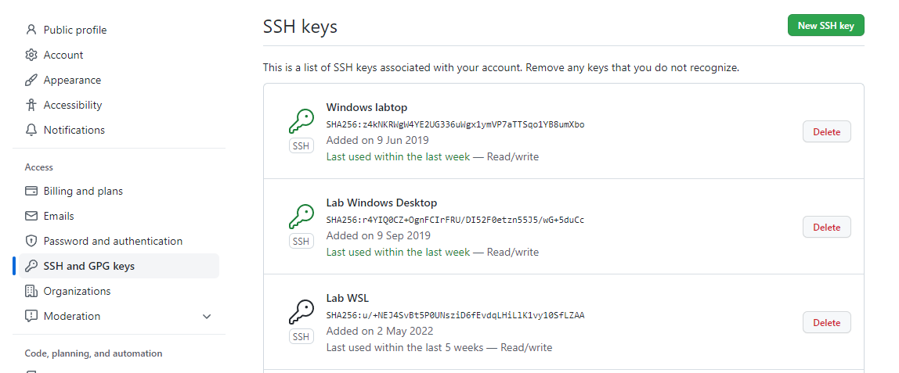
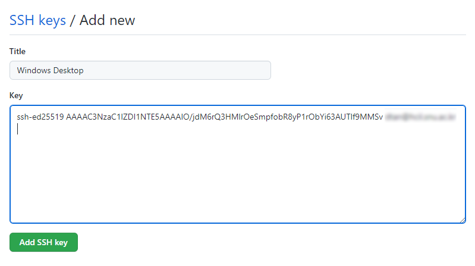

## Git 명령어 상세
### 0. 초기 설정
* [이전으로 돌아가기](./README.md#0-초기-설정)
#### SSH 키 생성 및 GitHub에의 등록
> 출처: https://www.lainyzine.com/ko/article/creating-ssh-key-for-github/
1. Git Bash (Windows) 또는 터미널(Linux/Mac) 실행
2. `cd ~/.ssh`
3. `ls`
   * `id_ed25519`와 `id_ed25519.pub`가 보이지 않으면 아래의 과정을 거쳐야 한다.
   * 예전 Git 유저의 경우 `id_rsa`와 `id_rsa.pub`가 보일 수도 있는데, 이 경우에는 4. ~ 7. 과정을 생략해도 좋다.
4. `ssh-keygen -t ed25519 -C "[your_email@example.com]"`
   * `[your_email@example.com]` 부분은 자신의 이메일로 대체해서 적는다.
   * ed25519 방식이 동작하지 않는 경우 대신 아래 명령을 입력한다.
     * `ssh-keygen -t rsa -b 4096 -C "[your_email@example.com]"`
5. 어느 위치에 저장할 것인지 물어본다.
   * 그냥 enter 키를 입력하면 기본값으로 설정되며 넘어간다.
6. 비밀번호(passphrase)를 입력하라고 물어본다.
   * 그냥 enter 키를 입력하면 비밀번호 없이 사용 가능하지만, 가급적이면 **비밀번호를 설정하는 것을 추천**한다.
7. 한 번 더 비밀번호를 입력하라고 물어본다.
   * 같은 비밀번호를 입력하면 된다.
   * 앞에서 enter로 넘어갔다면 또 enter를 누르면 된다.
8. 이제 아래 사진처럼 출력되면서 `~/.ssh/` 폴더 안에 SSH 키가 생성되었다.
   * 
   * Windows의 경우 기본값 위치는 `C:\Users\[계정 이름]\.ssh\` 에 있을 것이다.
   * ed25519 방식으로 생성한 경우 두 개의 파일 `id_ed25519`와 `id_ed25519.pub`가 생성된다.
   * RSA 방식으로 생성한 경우 두 개의 파일 `id_rsa`와 `id_rsa.pub`가 생성된다.
   * **주의: `id_ed25519` 또는 `id_rsa`의 내용은 절대 다른 사람에게 공개되어서는 안 된다!**
     * 이것은 private key라고 부른다.
   * `id_ed25519.pub` 또는 `id_rsa.pub`의 내용은 다른 사람들에게 공개되어도 상관 없다.
     * 이것은 public key라고 부른다.
9.  `id_ed25519.pub`의 내용물을 복사한다.
    * Windows에서는 `clip < ~/.ssh/id_ed25519.pub` 실행
    * Mac에서는 `pbcopy < ~/.ssh/id_ed25519.pub` 실행
10. [GitHub](https://github.com)에 접속하여 Sign in 한다.
11. 아래 사진처럼 상단 오른쪽에 있는 자신의 초상화를 클릭하고 "Settings"를 클릭한다.
    * 
12. 아래 사진처럼 "SSH and GPG keys" 메뉴로 들어간다.
    * 
13. 오른쪽 위에 있는 초록색 "New SSH key" 버튼을 클릭한다.
14. 아래 사진처럼 "Title"에는 자신이 알아볼 수 있도록 제목을 넣고, "Key"에는 위에서 복사한 `id_ed25519.pub`의 내용물을 붙여넣는다.
    * 
    * 필자는 개인적으로 "Title"에 컴퓨터 종류를 적는다.
15. 아래 초록색 "Add SSH key" 버튼을 클릭한다.
    * 이제 이 컴퓨터에서 SSH를 통한 GitHub 접근이 가능하다!