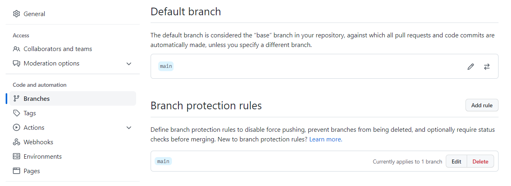
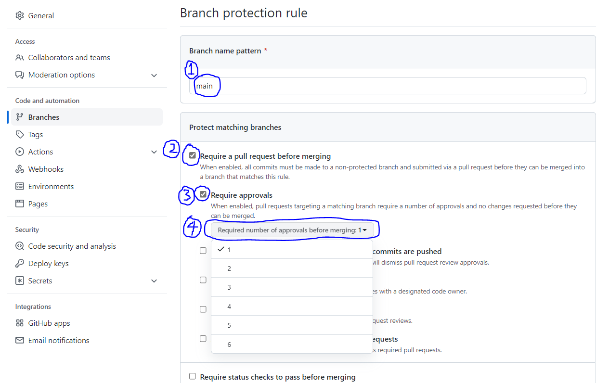

# 브랜치 보호하기
* 해당 레포지토리에 대해 Admin 권한을 가진 사람들은 특정 브랜치가 잘못된 명령으로부터 보호받을 수 있도록 설정할 수 있다.
* 특정 브랜치를 보호받는 브랜치로 설정할 때, 여러 가지 보호 옵션을 설정할 수 있다.
  * 그 중에서도 직접 해당 브랜치에 푸시할 수 없고 PR을 통해서만 변경 사항을 반영할 수 있도록 설정하는 방법을 소개한다.
* 공식 문서는 [여기](https://docs.github.com/en/repositories/configuring-branches-and-merges-in-your-repository/defining-the-mergeability-of-pull-requests/about-protected-branches#require-pull-request-reviews-before-merging)를 참조

---

1. GitHub에서 본인이 Admin 권한을 가진 레포지토리의 Settings로 들어간다.
  * 본인이 생성한 레포지토리이면 본인이 Admin 권한을 가진다.
  * 그렇지 않다면 Admin 권한을 가진 사람에게 [Settings] - [Collaborators and teams] - [Manage access] - [Add people]을 통해 자신을 추가하고 Admin 권한을 부여해달라고 부탁해야 한다.
  * Admin 권한이 없는 사람은 브랜치 보호하기 설정을 할 수 없다.
2. 아래 사진처럼 [Settings] - [Branches] - [Branch protection rules]에서 "Add rule" 버튼을 누른다.
  * 
3. 아래 사진의 (1)처럼 보호할 브랜치 이름을 "Branch name pattern"에 적는다.
  * 보통 주 브랜치인 `main`을 보호하면 좋다.
4. 보호할 브랜치로 직접 푸시하는 것을 막고 풀 리퀘스트(PR)를 통해서만 변경 사항을 반영하게 하려면 아래 사진의 (2) "Require a pull request before merging"에 체크한다.
5. PR 과정에서 다른 사람들의 승인이 필요하도록 강제하려면 아래 사진의 (3) "Require approvals"에 체크한다.
6. 특정 인원 이상의 사람들이 승인해야 PR의 머지가 가능하도록 강제하려면 아래 사진의 (4) "Required number of approvals before merging"을 눌러 인원을 변경할 수 있다.
  * 
7. 그 외에도 많은 브랜치 보호 기능들이 있으니 직접 살펴보고 설정하면 된다.
  * "Require linear history": 머지 커밋이 쌓이지 않게 하는 기능
  * "Include administrators": Admin 권한이 있는 사람들에게도 동일한 브랜치 보호 규칙 적용 (여기에 체크하지 않으면 Admin들은 보호되는 브랜치에도 직접 푸시할 수 있다.)