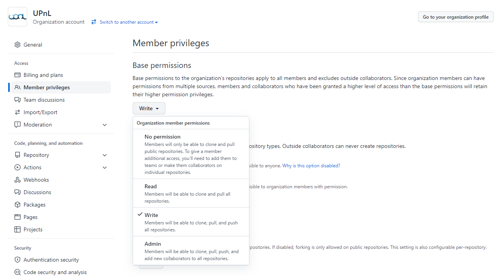
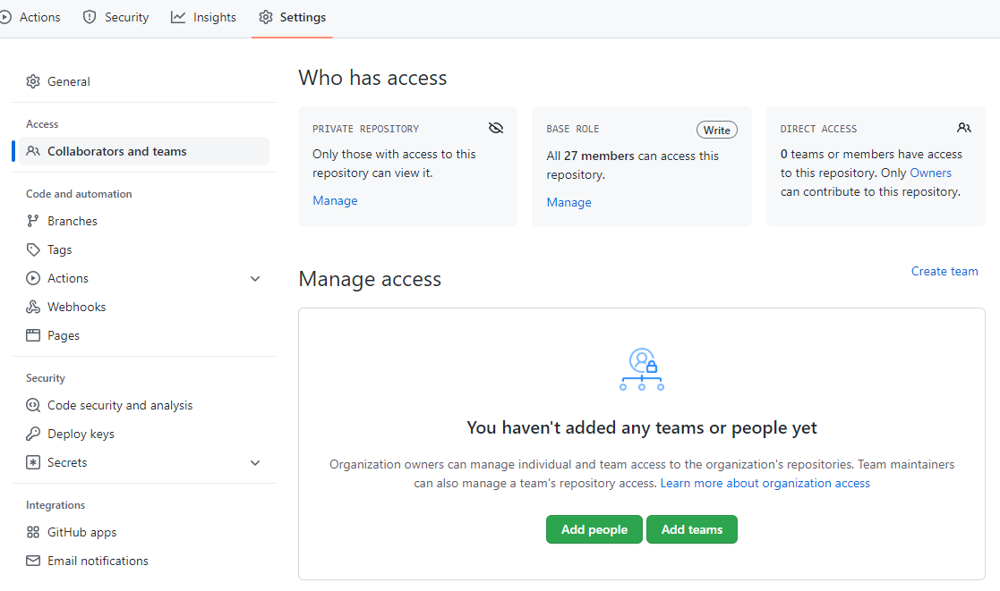

# 실습
> 2022-06-18

* 백문이 불여일견이니 모든 과정을 간단하게 체험해보자.
* [설치](../install/README.md) 및 [초기 세팅](../setting/README.md)은 완료된 상태라고 가정하고 시작한다.

## 팀 프로젝트에 합류하는 시나리오
* 프로젝트를 발주하게 되면, 누군가는 새 레포지토리를 파게 된다.
  * 이때는 [프로젝트를 새로 생성하기](../usage/create-new-project.md)를 보고 따라하면 된다.
* 그러나 오늘 다룰 실습에서는 누군가가 이미 레포지토리를 만들어 둔 상태에서 여러분이 이 프로젝트에 합류하는 시나리오를 다루고자 한다.
  * 그러려면 우선 해당 레포지토리에 대한 접근 및 수정 권한을 여러분이 얻어야 한다.
  * 다행히도 여러분은 모두 UPnL 그룹에 가입되어 있고, UPnL에서는 아래 사진과 같이 그룹 구성원 모두에게 수정 권한을 주기 때문에 큰 문제가 없다.
    * 
>  * 참고: 만약 다른 사람이 만든 레포지토리의 수정 권한을 얻고자 한다면, 해당 레포지토리의 admin 권한을 가진 사람에게 초대를 받아야 한다.
>    * 방법은 아래 사진처럼 [Settings] - [Collaborators and teams] - [Manage access]의 초록색 "Add people" 버튼을 눌러서 초대할 사람의 GitHub 아이디를 입력하는 것이다.
>    * 
* 여러분이 합류하게 될 프로젝트의 레포지토리 주소는 다음과 같다.
  * https://github.com/upnl/git-practice
  * 이 레포지토리는 **private 레포지토리**이므로, UPnL 그룹에 소속된 GitHub 아이디로 접속하지 않으면 "404 Page not found"가 보일 것이다.
  * 자신의 GitHub 아이디로 Sign in 하기를 바란다.