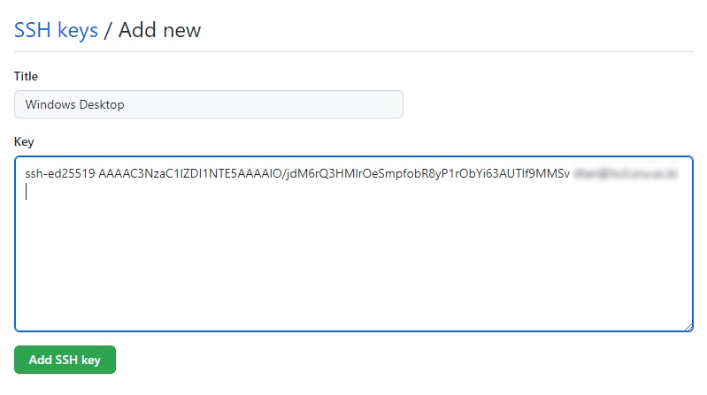

# SSH 키 생성 및 GitHub에 등록

GitHub을 이용하려면 적절한 방법으로 GitHub과 인증 과정을 거쳐야 한다. 여기서는 SSH 키를 생성하여 GitHub에 등록하는 과정을 설명한다.
더 자세한 매뉴얼은 [GitHub 공식 문서][connecting-github-by-using-ssh]를 참고하라.

## SSH 키 생성

우선 할 일은 기존에 만든 SSH 키가 있는지 확인하는 작업이다.

터미널을 열고, `ls ~/.ssh` 를 입력한 후 `id_ed25519` 또는 `id_rsa` 가 있는지 확인한다.
만약 이러한 파일이 이미 존재한다면 이 과정을 생략하고 [다음 과정](#github에-ssh-키-등록)을 진행해도 좋다.

기존 키가 없다면 다음을 수행하여 새로운 SSH 키를 생성한다.

1. 다음을 입력하여 새로운 키를 생성한다.
   첫번째 줄은 Ed25519 알고리즘을, 두번째 줄은 RSA 알고리즘을 이용하는 SSH 키를 생성하는 방법이다.
   두 가지 방법 중 하나만 수행하면 되며, Ed25519 방식을 권장한다.
   ```console
   $ ssh-keygen -t ed25519 -C "[your_email@example.com]"
   $ ssh-keygen -t rsa -b 4096 -C "[your_email@example.com]"
   ```

2. 키 생성을 시도하면 먼저 어느 위치에 저장할 것인지 물어보는데,
   enter 키를 입력하면 기본값으로 설정되어 넘어간다.
   ```console
   > Generating public/private algorithm key pair.
   > Enter file in which to save the key (/path/to/home/.ssh/algorithm):
   ```

3. 다음은 비밀번호(passphrase)를 입력하는 과정이다. 원하는 비밀번호를 입력한 후 enter 키를 입력하여 설정 가능하다.
   만약 비밀번호 없이 사용하고 싶은 경우 빈 칸으로 넘어가면 된다.
   ```console
   > Enter passphrase (empty for no passphrase):
   ```

4. 한번 더 비밀번호를 입력한다. 같은 비밀번호를 입력하되, 이전에 빈 비밀번호로 넘어갔다면 또 enter 키를 누르면 된다.
   ```console
   > Enter same passphrase again:
   ```

5. 이제 다음과 같이 유사한 출력이 나오면 SSH 키가 생성이 된 것이다.
   생성한 키는 기본적으로 `~/.ssh/` 폴더 안에 생성되며, Ed25519 방식의 경우 `id_ed25519` 와 `id_ed25519.pub` 파일이 생성된다.
   만약 RSA라면 `id_rsa`, `id_rsa.pub` 파일이 생성된다.
   ```console
   Your identification has been saved in /home/user/.ssh/id_ed25519
   Your public key has been saved in /home/user/.ssh/id_ed25519.pub
   The key fingerprint is:
   SHA256:ST4YSAYHqCufkOFQPmAy9snp96U+AsUu5wh+BulN/Ak your_email@example.com
   The key's randomart image is:
   +--[ED25519 256]--+
   | .oo+            |
   |=o.+ .           |
   |==o = . .        |
   |+ o= o = .       |
   |o++.o . S        |
   |== E +   o       |
   |+o=.X o o        |
   | oo= = +         |
   |  o   o..        |
   +----[SHA256]-----+
   ```

> 참고로 `.pub` 확장자가 붙은 파일은 public key, 그렇지 않은 파일은 private key라고 부른다.
> public key는 다른 사람들에게 공개하는 키지만, private key는 **절대 다른 사람에게 공개되어서는 안 된다.**
> 이는 패스워드를 다른 사람에게 알려주는 것과 동일한 행동이다. 절대 유출되지 않도록 하자.

## GitHub에 SSH 키 등록

이제 앞에서 생성한 SSH 키의 public key를 GitHub에 등록하면 된다.

1. 먼저 public key를 출력한 후 내용물을 복사한다.
   Windows에서는 `cat ~/.ssh/id_ed25519.pub | clip.exe`,
   macOS 에서는 `cat ~/.ssh/id_ed25519.pub | pbcopy` 를 입력하여 복사 가능하다.

2. [GitHub][github]에 접속한 후 Sign in을 한다. 만약 계정이 없다면 계정을 만든 후 진행한다.

3. 아래 사진처럼 오른쪽에 있는 자신의 초상화를 클릭하고 "Settings"를 클릭한다.
   

4. 아래 사진처럼 "SSH and GPG keys" 메뉴로 들어간다.
   그리고 오른쪽 위에 있는 초록색 "New SSH key" 버튼을 클릭한다.
   

5. 아래 사진처럼 "Title"에는 자신이 알아볼 수 있도록 제목을 넣고, "Key"에는 위에서 복사한 public key의 내용물을 붙여넣는다.
   Title을 채우기 어렵다면 지금 등록하는 컴퓨터의 정보를 입력하자.
   

6. 마지막으로 아래에 있는 초록색 "Add SSH key" 버튼을 클릭한다.

위 과정을 마친 후에는 이제 생성한 SSH 키를 이용하여 GitHub 접근이 가능하다!

## SSH 테스트

실제로 SSH 키가 잘 등록되었는 지 확인하고 싶다면 다음을 수행한다.

1. 터미널을 열고 다음을 입력한다.
   ```console
   $ ssh -T git@github.com
   ```

2. `ssh`를 통해 처음으로 GitHub에 접속한다면 다음과 같은 경고 메시지가 뜰 것이다.
   [GitHub의 public key fingerprint][github-public-key-fingerprint]랑 일치하는 지 확인한 후, 맞다면 `yes`를 입력한다.
   ```console
   The authenticity of host 'github.com (20.200.245.247)' can't be established.
   ED25519 key fingerprint is SHA256:+DiY3wvvV6TuJJhbpZisF/zLDA0zPMSvHdkr4UvCOqU.
   This key is not known by any other names
   Are you sure you want to continue connecting (yes/no/[fingerprint])?
   ```

3. 특별한 에러 없이 다음과 같은 메시지가 뜬다면 SSH 키 등록이 잘 완료된 것이다.
   ```console
   Hi username! You've successfully authenticated, but GitHub does not
   provide shell access.
   ```

[connecting-github-by-using-ssh]: https://docs.github.com/en/authentication/connecting-to-github-with-ssh
[github]: https://github.com
[github-public-key-fingerprint]: https://docs.github.com/en/authentication/keeping-your-account-and-data-secure/githubs-ssh-key-fingerprints
