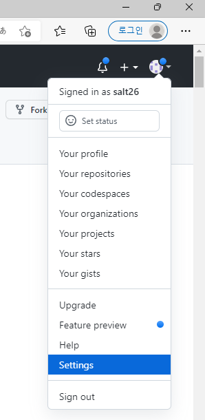

# SSH 키 생성 및 GitHub에 등록
GitHub을 이용하려면 SSH 키를 생성하여 GitHub에 등록하는 과정이 필요하다.

1. 터미널을 실행한다.
2. `ls ~/.ssh` 를 입력하여 `id_ed25519` 또는 `id_rsa` 가 있는지 확인한다.  
   만약 존재한다면 3 ~ 6 과정을 생략해도 좋다.
3. `ed25519` 또는 `rsa` 방식으로 새로운 키를 생성한다. `ed25519` 방식을 권장한다.
   ```
   ssh-keygen -t ed25519 -C "[your_email@example.com]"
   ssh-keygen -t rsa -b 4096 -C "[your_email@example.com]"
   ```
4. 어느 위치에 저장할 것인지 물어보는데, enter 키를 입력하면 기본값으로 설정되어 넘어간다.
5. 비밀번호(passphrase)를 입력하라고 물어본다.
   그냥 enter 키를 입력하면 비밀번호 없이 사용 가능하지만, GitHub 에서는 **비밀번호를 설정하는 것을 권장**한다.
6. 한번 더 비밀번호를 입력한다. 같은 비밀번호를 입력하되, 이전에 빈 비빌번호로 넘어갔다면 또 enter 를 누르면 된다.
7. 이제 다음 사진처럼 출력되면서 `~/.ssh/` 폴더 안에 SSH 키가 생성되었다.
   `ed25519` 방식의 경우 `id_ed25519` 와 `id_ed25519.pub` 파일이 생성된다. (rsa의 경우 `id_rsa`, `id_rsa.pub`)
   `id_ed25519` 파일은 private key로 **절대 다른 사람에게 공개되어서는 안 된다!**
   `id_ed25519.pub` 파일은 publick key로 다른 사람들에게 공개되어도 상관 없다.
   
8. `id_ed25519` 의 내용물을 복사한다.  
    Windows에서는 `cat ~/.ssh/id_ed25519.pub | clip`, macOS 에서는 `cat ~/.ssh/id_ed25519.pub | pbcopy` 를 입력하여 복사 가능하다.
9. [GitHub](https://github.com)에 접속하여 Sign in 한다.
10. 아래 사진처럼 상단 오른쪽에 있는 자신의 초상화를 클릭하고 "Settings"를 클릭한다.
    
11. 아래 사진처럼 "SSH and GPG keys" 메뉴로 들어간다.
    
12. 오른쪽 위에 있는 초록색 "New SSH key" 버튼을 클릭한다.
13. 아래 사진처럼 "Title"에는 자신이 알아볼 수 있도록 제목을 넣고, "Key"에는 위에서 복사한 `id_ed25519.pub`의 내용물을 붙여넣는다.  
    필자는 개인적으로 "Title"에 컴퓨터 종류를 적는다.
    
14. 아래 초록색 "Add SSH key" 버튼을 클릭한다.  
    이제 이 컴퓨터에서 SSH를 통한 GitHub 접근이 가능하다!
