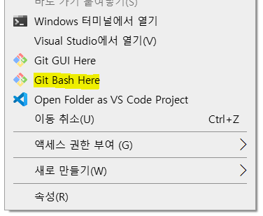
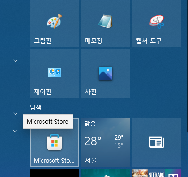
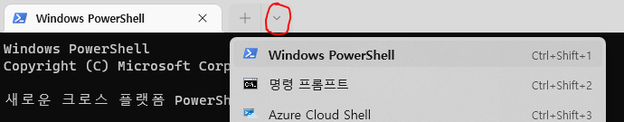

# 터미널 세팅
Git 명령어를 입력하려면 우선 터미널을 실행하여야 한다.

## Windows
Windows 에는 크게 2가지 방법이 있다.

### Git Bash 이용
Windows 에서는 Git 설치 시 Git Bash가 기본으로 설치가 된다.  
프로젝트 루트 폴더에서 파일 탐색기의 빈 공간을 마우스 우클릭을 한 다음, "Git Bash Here" 를 클릭한다.

### Windows Terminal (PowerShell) 이용
Windows 에서 제공하는 차세대 터미널인 [Windwos Terminal] 을 사용한다.  
Microsoft Store를 실행한 후, "Windows Termianl" 을 검색하여 설치 후 실행하면 된다.  
기본값으로 Windows PowerShell 이 열리는데, 만약 다른 것이 열린다면 아래 화살표 버튼을 누르고 Windows PowerShell 을 실행한다.

## Linux
각 리눅스 배포판에서 기본으로 제공하는 터미널을 사용한다.

## macOS
기본 터미널을 이용하거나, [iTerm2] 터미널을 사용한다.

터미널 세팅이 끝났다면, `cd` 명령어를 이용해 프로젝트의 루트 폴더로 이동한다.  
이제 Git 명령어를 상황에 맞게 입력하면 된다.

[Windows Terminal]: https://github.com/microsoft/terminal
[iTerm2]: https://iterm2.com
