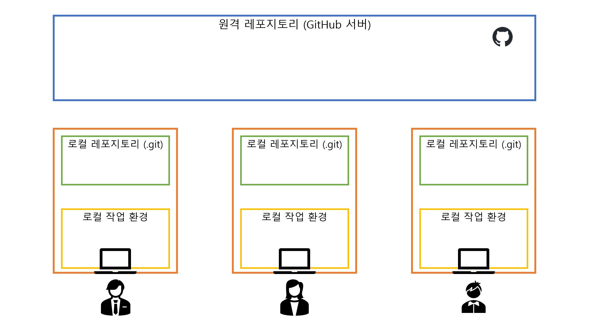
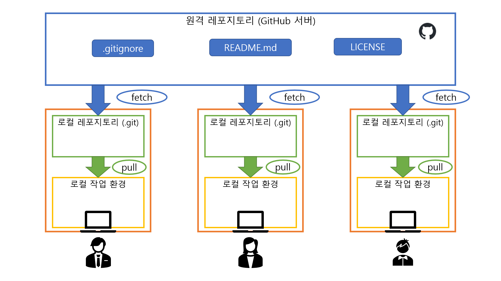
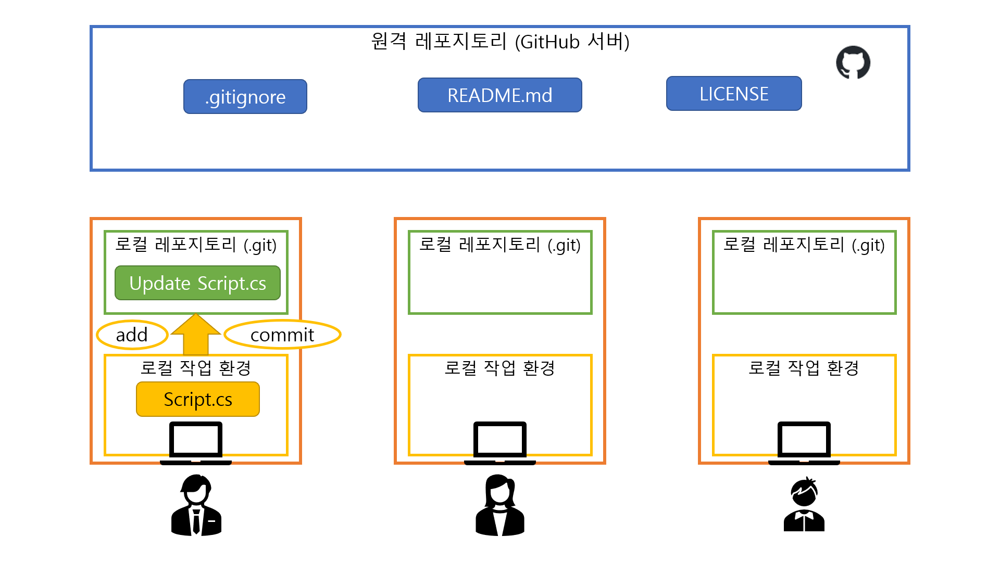
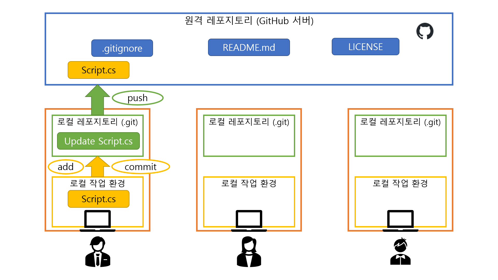
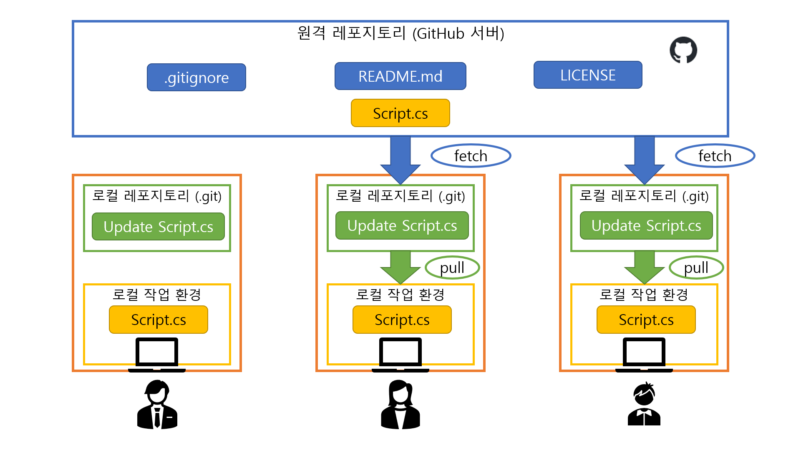
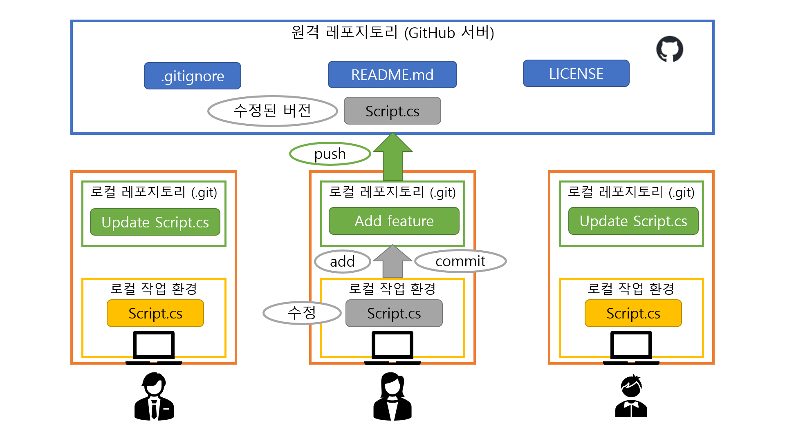
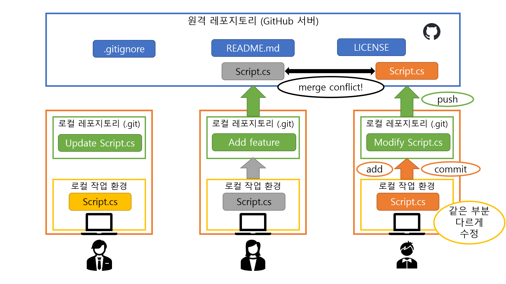

# 기본 개념
* Git: 버전 관리 시스템의 일종.
* 로컬 작업 환경: 내 컴퓨터의 폴더에 있는 파일들을 말한다. 파일을 열어서 직접 수정할 수 있다.
* 로컬 레포지토리: 내 컴퓨터의 `.git` 폴더 안에서 Git이 관리하는 파일들을 말한다. 직접 수정할 수는 없지만 Git 명령어를 통해 조작할 수 있다.
* 원격 레포지토리: GitHub 등 원격 서버에 저장되어 관리되는 파일들을 말한다. 다른 사용자들과 공유된다.

## 그림으로 이해하기
1. 
---
2. 
---
3. 
---
4. 
---
5. 
---
6. 
---
7. 