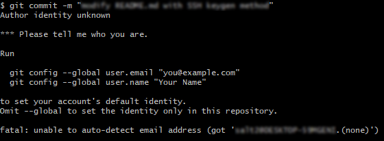

# 로컬 변경 사항을 저장하기
> Git은 변경사항을 자동으로 추적하지 못한다. 따라서 어느 파일이 어떻게 바뀌었는지 Git에게 알려주는 작업이 필요하다.
1. 브랜치가 내가 작업할 브랜치인지 확인
   * 처음 프로젝트를 시작하면 기본 브랜치가 `main`으로 설정되어 있다.
   * 혼자 작업할 때에는 아무 브랜치에서 작업해도 상관 없지만, 공동으로 작업할 때에는 개인별로 하나씩의 브랜치를 파서 각자의 브랜치에서 작업한 후에 `main`으로의 풀 리퀘스트를 날리는 것이 권장된다.
   * 브랜치를 변경하거나 새로 파야 하는 경우 [브랜치를 변경할 때](#6-브랜치를-변경할-때)의 명령어를 입력한다.
2. 로컬 작업 환경에서 파일 변경
3. `git status`
   * 어떤 파일이 변경되었는지 확인한다.
4. `git add .`
   * 로컬 작업 환경에서 변경된 모든 파일을 Git이 추적하게 해준다.
   * 모든 파일이 아닌 특정 파일만 Git이 추적하게 하려면, `.` 대신 해당 파일의 경로를 입력하면 된다.
     * 예: `git add ./Repository/Assets/Scripts/Player/Player.cs`
5. `git commit -m "[커밋 메시지]"`
   * Git이 추적하고 있는 변경사항을 현재 브랜치에 커밋하여 반영한다.
   * 커밋 메시지는 남들이 메시지만 봐도 무엇이 바뀌었는지 쉽게 알 수 있도록 친절하게, 요약하여 작성한다.
     * 좋은 예: `git commit -m "Add some sprites and fix scroll bug"`
     * 나쁜 예: `git commit -m "minor"`
   * 커밋 메시지를 한글로 작성하는 것도 가능하다.
   * 한번 커밋하면 되돌리기 어렵다. 신중히 입력하자.
     * 지난 커밋을 조작하는 방법이 있기는 하지만, 여기서 다루지는 않겠다.
     * 잘못된 커밋을 `git push`하면 정말 큰일난다. 이때는 조작하기도 어렵다.
   * 계정 아이덴티티 설정이 되어 있지 않다면 커밋 시 아래 사진과 같은 문구가 뜨면서 커밋이 되지 않을 수 있다.
     * 
     * 이 경우 [계정 아이덴티티 설정](#계정-아이덴티티-설정)을 수행한 후에 다시 시도하자.
6. [로컬 레포지토리의 변경사항을 원격 레포지토리에 업로드할 때](#3-로컬-레포지토리의-변경사항을-원격-레포지토리에-업로드할-때)의 명령어 입력

