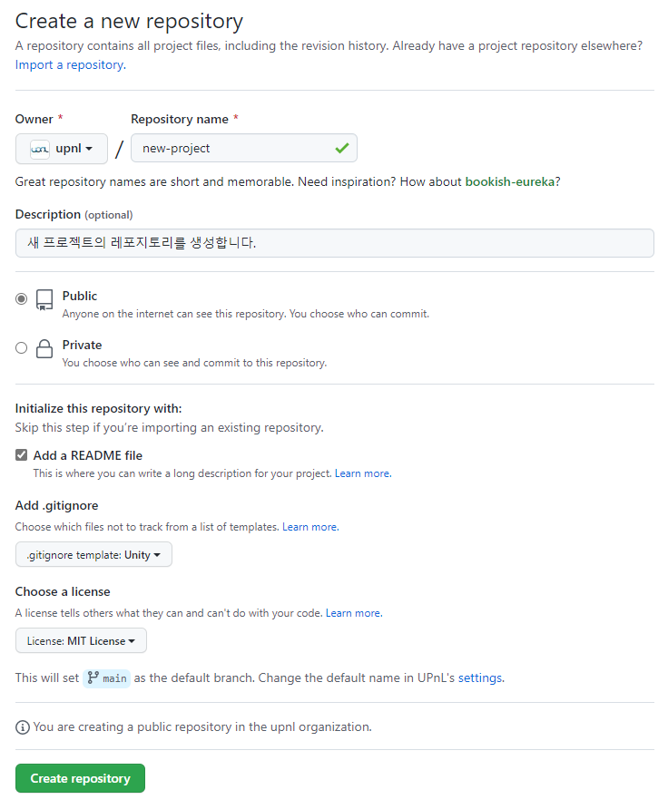

# 프로젝트를 새로 생성하기
1. GitHub에서 새로운 원격 레포지토리 생성
   * GitHub 홈페이지에 Sign in 후 New 버튼을 누른다.
   * 
   * 위 사진에서 "Repository name"에 새 레포지토리의 이름을 정한다.
     * 보통 소문자로만 쓰고 띄어쓰기는 `-`로 대체하는 것이 일반적이다.
   * "Description"에 프로젝트 설명을 적는다. (선택사항)
   * "Public" 또는 "Private"을 선택한다.
     * 보안이 중요한 프로젝트가 아니라면 "Public" 선택을 추천한다. 기능이 더 많이 지원되기 때문이다.
   * "Add a README file"을 체크하면 좋다.
     * 어차피 나중에 수정해야 하긴 하지만...
   * **"Add .gitignore"는 프로젝트의 종류에 맞게 선택해야 한다!**
     * 가령, Unity 프로젝트라면 "Unity"를 선택한다.
     * 이것을 선택하면 `.gitignore` 파일이 추가되고, 해당 프로젝트에서 자동으로 생기지만 레포지토리에 포함할 필요가 없는 파일들(무거운 빌드 파일 또는 임시 파일 등)을 자동으로 Git이 추적하지 않게 해준다.
     * **적절한 `.gitignore`가 없으면 나중에 불편할 것이다.**
   * "Choose a license"에서는 보통 "MIT License"를 쓰거나, 아니면 선택하지 않기도 한다.
     * MIT License는 코드의 저작자만 명시한다면 코드의 복제, 수정, 상업적 이용 등을 허용하는, 매우 자유로운 라이선스이다.
     * 다른 라이선스를 선택할 수도 있지만, 제한 사항이 많이 존재할 수 있다.
     * 라이선스가 없으면 공개 프로젝트에서는 문제가 될 수도 있다.
   * 완료되면 초록색 "Create repository" 버튼을 누른다.
2. 아래 사진처럼 초록색 "Code" 버튼을 누르고 표시되는 주소 복사
   * 
   * HTTPS보다는 SSH 주소를 사용하는 것을 추천한다.
   * 다만 SSH 주소를 사용하려면 사전 작업이 필요하다.
   * SSH 키를 생성하고 공개키를 GitHub에 등록하는 과정은 [SSH 키 생성 및 GitHub에 등록](../setting/ssh.md)을 참조한다.
3. `git init`
   * 해당 폴더를 로컬 작업 환경으로 하고 로컬 레포지토리를 생성하는 명령이다.
4. `git remote add origin [원격 레포지토리의 SSH 또는 HTTPS 주소 붙여넣기]`
   * origin 말고 다른 이름을 사용할 수 있지만 보통은 origin 사용
   * Windows 기준으로 Git Bash에 주소를 붙여넣을 때에는 오른쪽 클릭 후 Paste 선택
   * 예: `git remote add origin git@github.com:upnl/simple-dodge-reference.git`
5. `git fetch origin`
   * 처음 SSH 접근을 시도하는 경우 아래 사진과 같은 문구가 뜰 수 있다.
     * 
     * 여기에서 `yes`를 입력하면 된다.
     * 만약 SSH 키 설정이 되어 있지 않다면 이때 `Permission denied` 오류가 뜰 수 있다. 이 경우 [SSH 키 생성 및 GitHub에 등록](../setting/ssh.md)을 수행한 후에 다시 시도하자.
   * SSH 키 생성 시 비밀번호를 설정한 경우, 비밀번호를 입력해야 fetch 명령이 실행된다.
6. `git pull origin main`
   * 비밀번호를 설정한 경우, 비밀번호를 입력해야 pull 명령이 실행된다.
   * 레포지토리 생성 시 자동 생성된 파일들(`README.md`, `.gitignore`, `LICENSE` 등)을 로컬로 가져와준다.
7. 로컬 작업 환경에서 파일 생성 및 수정
8. [로컬 변경 사항을 저장하기](commit.md)의 명령어 입력
