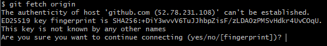

# 프로젝트를 새로 생성하기

1. GitHub에서 새로운 원격 레포지토리 생성
   * GitHub 홈페이지에 Sign in 후 New 버튼을 누르고 레포지토리 이름을 정해서 생성하면 된다.
2. 아래 사진처럼 초록색 "Code" 버튼을 누르고 표시되는 주소 복사
   * 
   * HTTPS보다는 SSH 주소를 사용하는 것을 추천한다.
   * 다만 SSH 주소를 사용하려면 사전 작업이 필요하다.
   * SSH 키를 생성하고 공개키를 GitHub에 등록하는 과정은 [SSH 키 생성 및 GitHub에 등록](../setting/ssh.md)을 참조한다.
3. `git init`
   * 해당 폴더를 로컬 작업 환경으로 하고 로컬 레포지토리를 생성하는 명령이다.
4. `git remote add origin [원격 레포지토리의 SSH 또는 HTTPS 주소 붙여넣기]`
   * origin 말고 다른 이름을 사용할 수 있지만 보통은 origin 사용
   * Windows 기준으로 Git Bash에 주소를 붙여넣을 때에는 오른쪽 클릭 후 Paste 선택
   * 예: `git remote add origin git@github.com:upnl/simple-dodge-reference.git`
5. `git fetch origin`
   * 처음 SSH 접근을 시도하는 경우 아래 사진과 같은 문구가 뜰 수 있다.
     * 
     * 여기에서 `yes`를 입력하면 된다.
     * 만약 SSH 키 설정이 되어 있지 않다면 이때 `Permission denied` 오류가 뜰 수 있다. 이 경우 [SSH 키 생성 및 GitHub에 등록](../setting/ssh.md)을 수행한 후에 다시 시도하자.
   * SSH 키 생성 시 비밀번호를 설정한 경우, 비밀번호를 입력해야 fetch 명령이 실행된다.
6. 로컬 작업 환경에서 파일 생성 및 수정
7. [로컬 변경 사항을 저장하기](commit.md)의 명령어 입력
