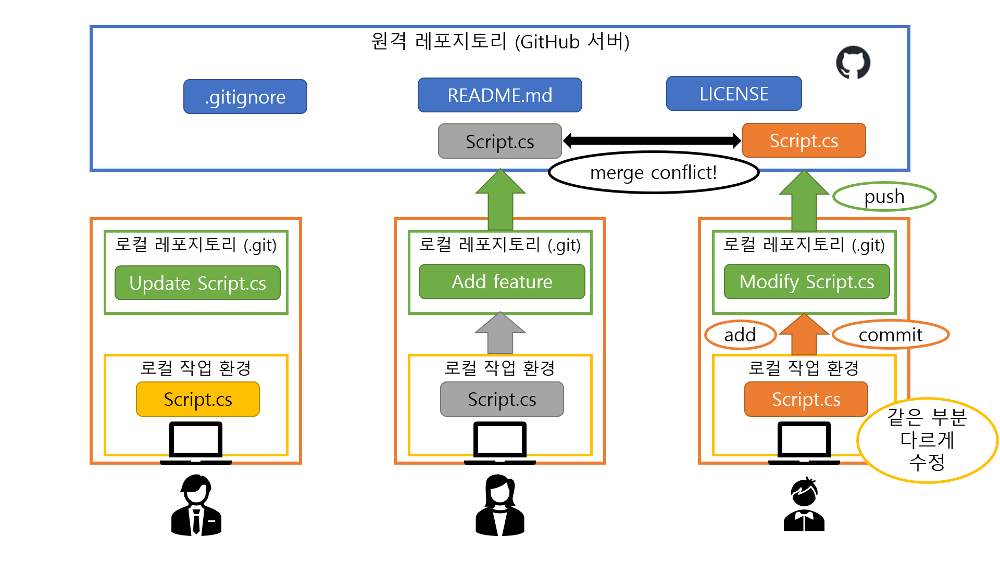

# 머지 컨플릭트 해결법
> 두 명 이상의 사람들이 같은 파일의 같은 부분을 동시에 서로 다르게 수정하는 경우에 머지 컨플릭트가 발생한다.

> 머지 컨플릭트가 일어나면 Git에게 두 변경사항 중 어느 것을 반영하고 어느 것을 버려야 하는지 알려주어야 한다.

* 우선 `git status`를 입력해보자.
  * 충돌한 파일이 어떤 것들이 있는지 알려준다.
* 충돌이 일어난 파일의 종류에 따라 해결 방법이 다르다.
  * 텍스트 기반 파일 (코드 등)
    1. 텍스트 편집기로 해당 파일을 연다.
    2. 검색(Ctrl+F)을 활용하여 `<<<<<<<` (`<` 7개)를 검색한다. 검색된 모든 부분에 대해 아래 3.과 4.의 과정을 반복한다.
    3. `<<<<<<<`가 있는 줄 아래부터 `========`이 있는 줄까지는 내 현재 브랜치에서 변경한 사항이 들어있고, `=======` 아래부터 `>>>>>>>`가 있는 줄까지는 머지하려는 브랜치(보통 다른 사람이 만든, 원격 레포지토리의 브랜치)에서 변경한 사항이 들어있다.
    4. 직접 보면서 적절하게 변경사항을 하나로 합치고, `<<<<<<<`가 있는 줄과 `=======`가 있는 줄과 `>>>>>>>`가 있는 줄을 모두 지운 다음, 파일을 저장한다.
      * 내가 만든 변경사항을 살릴지, 다른 사람이 만든 변경사항을 살릴지, 둘을 적절히 병합할지는 그때그때 다르다.
    5. 모든 머지 컨플릭트가 해결되면 [로컬 변경 사항을 저장하기](commit.md)의 명령어를 입력한다.
    6. 커밋 후 `git push` 명령어를 입력하면 커밋 메시지 에디터(Git 설치 시에 설정했던, VS Code, 메모장, Vim 등의 에디터)가 열리면서 `Merge branch '[머지하려는 브랜치]' into [내 현재 브랜치]`가 뜰 때가 있다.
      * 이것이 머지 커밋이다.
      * 이때는 에디터를 닫아주면 정상적으로 머지 커밋과 `git push`가 진행된다.
      * 머지 커밋 메시지를 변경하고 싶으면 변경해도 되는데, 이때는 변경 후 저장하고 에디터를 종료하면 된다.
  * 바이너리 파일 (응용 프로그램, 이미지 등)
    * 편집기로 직접 수정하기 어려운 파일이므로, 두 변경사항 중 하나를 취사선택하는 것만 가능하다.
    1. 내 현재 브랜치의 변경사항을 살릴 때 (머지하려는 브랜치의 변경사항을 버릴 때)
      * `git checkout --ours -- [충돌한 파일 경로]`
      * (띄어쓰기에 유의)
    2. 머지하려는 브랜치의 변경사항을 살릴 때 (내 현재 브랜치의 변경사항을 버릴 때)
      * `git checkout --theirs -- [충돌한 파일 경로]`
      * (띄어쓰기에 유의)
    * 모든 충돌을 해결했으면 `git push` 명령어를 입력한다. 이때 커밋 메시지 에디터가 뜰 수 있는데, 에디터를 닫아주면 정상적으로 머지 커밋과 `git push`가 진행된다.
  * Unity의 `.unity`(scene) 파일 및 `.prefab`(프리팹) 파일
    * 가급적이면 `.unity` 파일 및 `.prefab` 파일에서 머지 컨플릭트가 발생하지 않도록 일감과 일정을 분배하는 것이 중요하다.
      * 한 번에 한 사람만 건드리도록 하고, 동시에 여러 명이 같은 파일을 가지고 작업하지 않아야 한다.
    * 그래도 머지 컨플릭트가 발생했다면 아래의 세 가지 방법으로 해결할 수 있다.
      1. 내가 해당 scene에 새로 만든 변경사항들을 패치노트처럼 전부 기억한 다음, 원격 레포지토리의 최신 버전(내 것과 충돌한 버전)을 만들어낸 상대방의 컴퓨터에서 Unity 에디터로 해당 scene을 열어서, 내가 만들었던 변경사항들을 똑같이 수동으로 반영하고 그것으로 덮어쓰는 방법 **(가장 추천하는 방법)**
      2. 바이너리 파일처럼 두 변경사항 중 하나를 취사선택하는 방법
         * 이 경우 한 쪽의 변경사항은 전부 버려지게 된다.
      3. 텍스트 기반 파일처럼  **텍스트 편집기로** 해당 파일을 열고 머지 컨플릭트를 수동으로 해결하는 방법 **(절대 비추천)**
         * Unity 에디터로 열지 않음에 유의!
         * `.unity` 파일이 기본적으로 yaml 구조라서 가능하긴 하지만...
         * 사용자는 Unity가 내부적으로 관리하는 에셋 ID를 알 방법이 없고, 이것이 꼬이면 굉장히 큰일이 난다.
         * 잘못 병합하면 scene 파일 구조가 깨져서 Unity로 열리지 않게 될 수 있다!
    * 모든 충돌을 해결했으면 `git push` 명령어를 입력한다. 이때 커밋 메시지 에디터가 뜰 수 있는데, 에디터를 닫아주면 정상적으로 머지 커밋과 `git push`가 진행된다.
