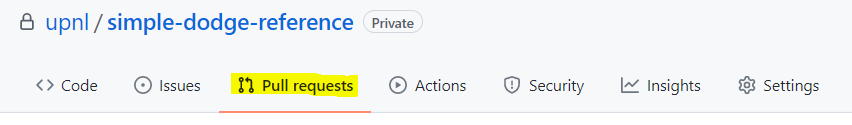
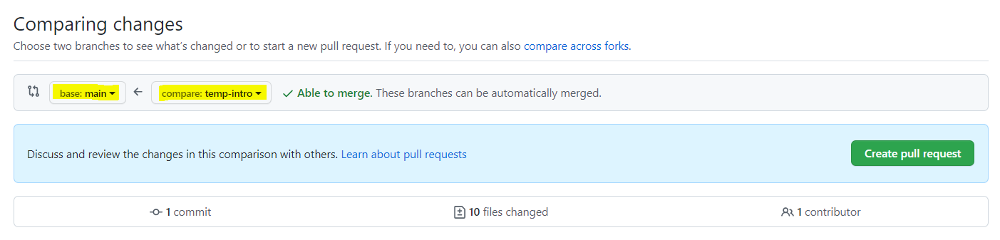
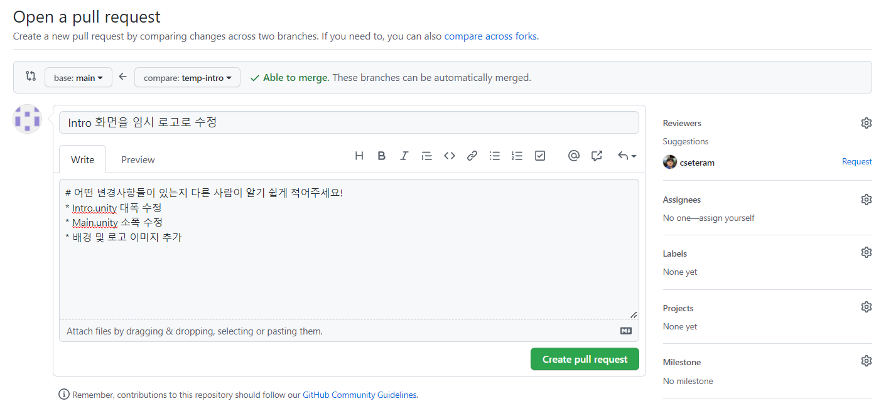
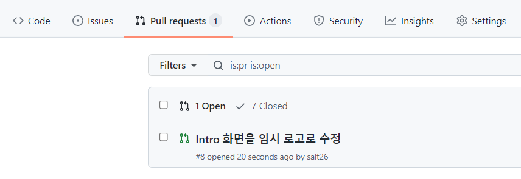
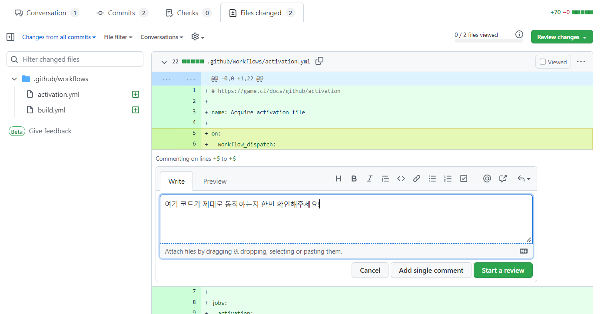

# 풀 리퀘스트 날리기
> 내 브랜치에서 작업한 커밋들을 `main` 브랜치에 합쳐서 다른 사람들에게도 보이도록 하고 싶을 때 풀 리퀘스트(PR)을 날린다.

> 공동으로 작업할 때, 내 브랜치를 직접 `main` 브랜치에 `git merge`해서 `git push`하는 것은 권장되지 않는다.

1. 내 브랜치에서 만든 모든 변경사항을 원격 레포지토리에 업로드
   * [로컬 변경 사항을 원격 저장소에 푸시하기](push.md)까지의 과정을 수행한 상태이면 된다.
2. [GitHub](https://github.com)에 접속하여 작업 중인 레포지토리로 이동
3. 아래 사진처럼 "Pull requests" 탭으로 이동
   * 
4. 초록색 "New pull request" 버튼 클릭
5. 아래 사진처럼 base 브랜치를 `main`으로, compare 브랜치를 내 브랜치 이름(머지할 브랜치)으로 설정
   * 
6. 위 사진처럼 "Able to merge." 메시지가 뜨면, 아래에 출력되는 변경사항들을 확인한 다음 초록색 "Create pull request" 버튼 클릭
   * 머지 컨플릭트가 있어서 머지할 수 없다는 메시지가 뜨면, 두 가지 방법으로 해결할 수 있다.
     1. 내 로컬 작업 환경의 내 브랜치에서 `git pull origin main`을 한 다음, [머지 컨플릭트 해결법](merge-conflict.md)을 수행하고, 다시 `git push`하여 풀 리퀘스트를 날리는 방법
     2. GitHub의 "Resolve conflicts" 기능을 활용하는 방법: [여기](https://docs.github.com/en/pull-requests/collaborating-with-pull-requests/addressing-merge-conflicts/resolving-a-merge-conflict-on-github) 참조
7. 아래 사진처럼 적당히 제목과 글을 작성하고 초록색 "Create pull request" 클릭
   * 
   * 다른 사람이 글을 읽었을 때 어떤 변경사항이 있는지 한눈에 알기 쉽도록 적는 것이 좋다.
   * 필요하다면 오른쪽에서 "Reviewers"나 "Assignees"를 설정하여 특정 사람에게 리뷰해달라고 지목할 수도 있다.
8. 풀 리퀘스트를 올렸다는 사실을 협업하는 사람들에게 알리고, 그들에게 리뷰 및 승인해달라고 한다.
   * 
   * 풀 리퀘스트를 올린 본인이 다른 사람들의 리뷰 없이 "Merge pull request" 버튼을 누르는 것은 권장되지 않는다.
9. 다른 사람들은 "Files changed" 탭으로 들어가서 해당 풀 리퀘스트의 파일 별 변경사항을 확인하고 리뷰를 남긴 다음 승인을 해야 한다.
   * 
   * 위 사진처럼 각 파일의 특정 줄(여러 줄도 드래그로 지정 가능)에 커서를 대면 파란색 "+" 버튼이 나타난다. 이 "+"를 누르면 해당 코드에 대한 리뷰를 작성할 수 있다.
   * **위 사진의 오른쪽 위에 있는 초록색 "Review changes"를 선택하면, 아래 사진처럼 세 가지 상태 중 하나로 전체적인 리뷰를 작성할 수 있다.**
     * 
     * ([사진 출처](https://docs.github.com/en/pull-requests/collaborating-with-pull-requests/reviewing-changes-in-pull-requests/about-pull-request-reviews))
     1. Comment: 명시적 승인 없이 일반적인 코멘트를 남기는 상태
     2. Approval: 이 풀 리퀘스트의 변경사항을 머지해도 된다고 승인하면서 코멘트를 남기는 상태
     3. Request changes: 머지 전에 꼭 고쳐야 할 사항이 있으므로 고쳐달라고 코멘트를 남기는 상태
   * 풀 리퀘스트를 올린 사람은 본인의 풀 리퀘스트를 승인할 수 없다.
   * 승인을 n명 이상에게 받아야만 머지가 가능하도록 레포지토리에 설정해 둘 수 있는 기능도 존재한다.
     * 심화 과정이지만, 관심이 있다면 [브랜치 보호하기](../advanced/protect-branch.md)를 참조하기 바란다.
     
10. 다른 사람들의 승인을 받았고 이 풀 리퀘스트가 `main` 브랜치에 반영되어도 문제가 없다고 확인하면 "Merge pull request" 버튼을 누를 수 있다.
   * 
   * 승인 과정 없이 머지를 진행하는 것은 권장되지 않는다.
   * 논의할 내용이 있으면 아래에서 "Comment"를 작성하는 것도 가능하다.
   * 머지 방식을 세 가지 중 선택할 수 있다.
     1. Create a merge commit (기본값)
     2. Squash and merge
     3. Rebase and merge
   * 자세한 내용은 [여기(공식 문서)](https://docs.github.com/en/repositories/configuring-branches-and-merges-in-your-repository/configuring-pull-request-merges/about-merge-methods-on-github) 또는 [여기(한글 문서)](https://nuritech.tistory.com/33)를 참조
